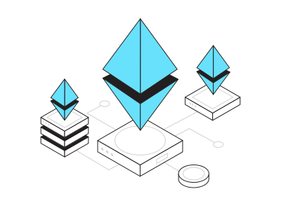

<h2 font-weight="bold">𝐒ervices 𝐒𝐞𝐭</h2>
<table>
  <tr>
    <td>
      
    </td>
    <td>
      
    </td>
    <td>
      
    </td>
    <td>
       
    </td>
    <td>
        
    </td>
    <td>
      
    </td>
    <td>
      
    </td>
    <td>
        
    </td>
    <td>
      
    </td>
    <td>
      
    </td>
    <td>
      
    </td>
    <td>
      
    </td>
    <td>
       
    </td>
    <td>
      
    </td>
  </tr>
  
  <tr>
    <td>
      
    </td>
    <td>
      
    </td>
    <td>
      
    </td>
    <td>
      
    </td>
    <td>
       
    </td>
    <td>
        
    </td>
    <td>
      
    </td>
    <td>
        
    </td>
    <td>
      
    </td>
    <td>
      
    </td>
    <td>
      
    </td>
    <td>
        
    </td>
    <td>
        
    </td>
    <td>
      
    </td>
  
  </tr>
  
  <tr>
    <td>
      
    </td>
    <td>
      
    </td>
    <td>
      
    </td>
    <td>
       
    </td>
    <td>
        
    </td>
    <td>
        
    </td>
    <td>
      
    </td>
    <td>
        
    </td>
    <td>
      
    </td>
    <td>
      
    </td>
    <td>
      
    </td>
    <td>
        
    </td>
    <td>
      
    </td>
    <td>
      
    </td>
  
  </tr>
</table>

<h1 font-weight="bold">What Can I do?</h1>

## Senior Blockchain & Full Stack Development

### Building DAPP (smart contract Development, Defi Development, NFT Minting, NFT MarketPlace).
 
  
### Front end Developing with Modern Front-end Libraries and Frameworks such as React, Vue, Next, Nuxt ,Angular.
 

### Back end Developing with Node.js(Express.js), Python(Django, Flask), Ruby on Rails, PHP(Laravel).
 
  

 

## *Contact me anytime*

<h5 color="red">Click anything for contact me (^_~)</h5>
